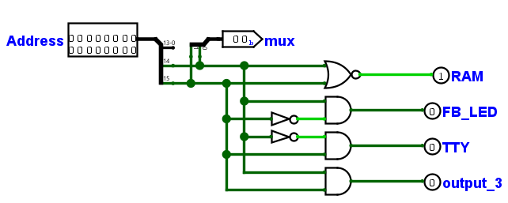
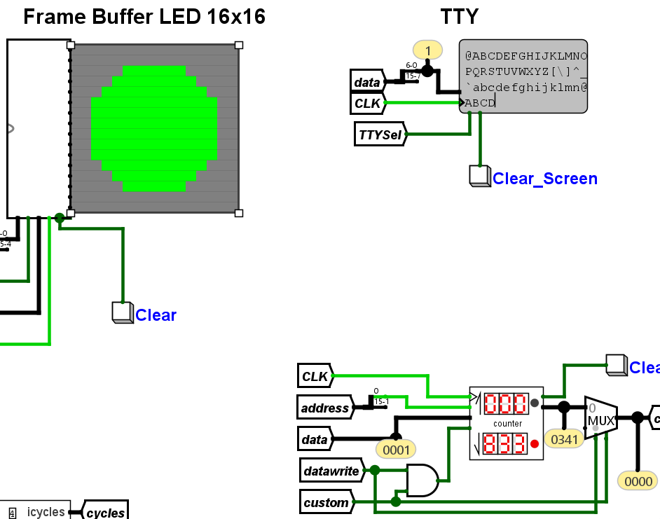
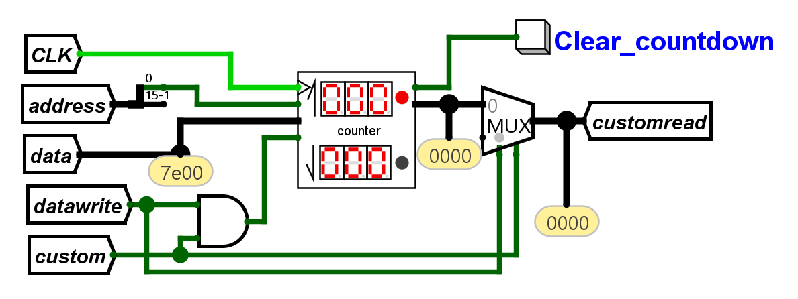
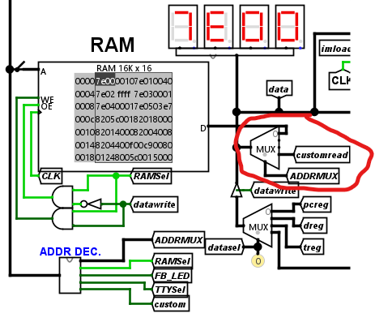
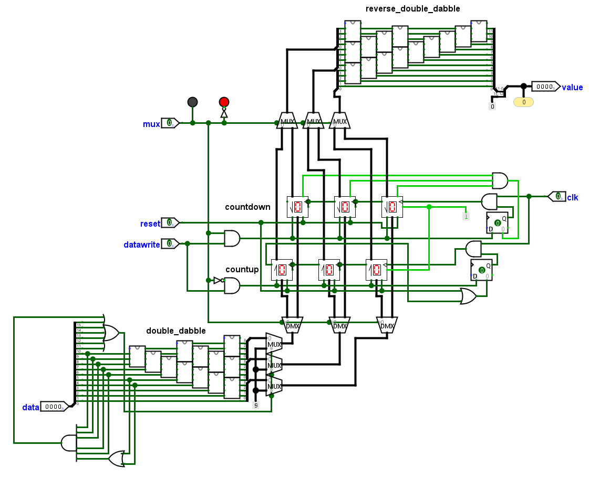
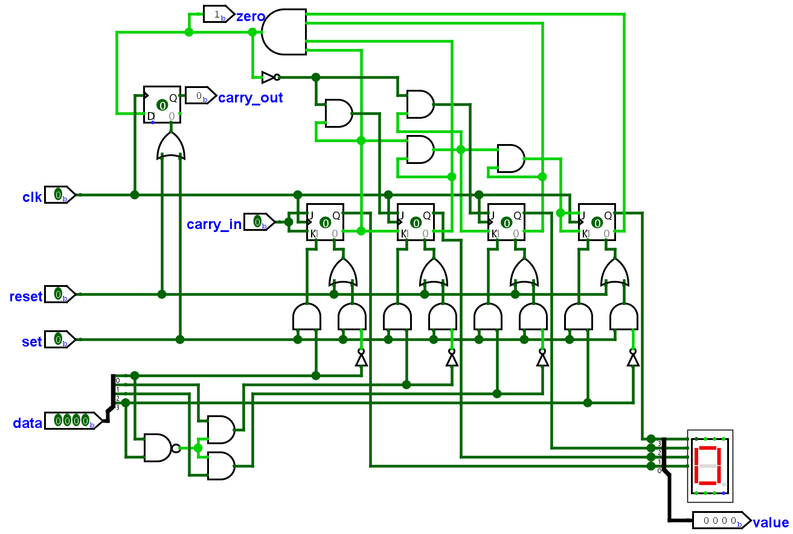
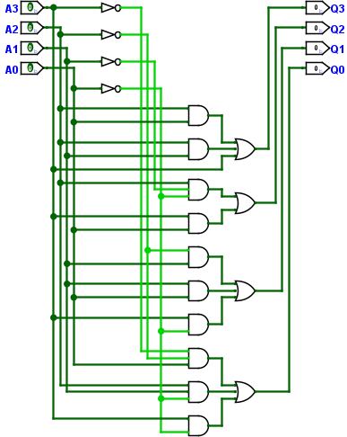
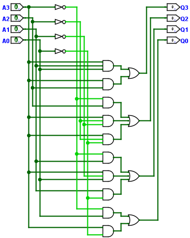
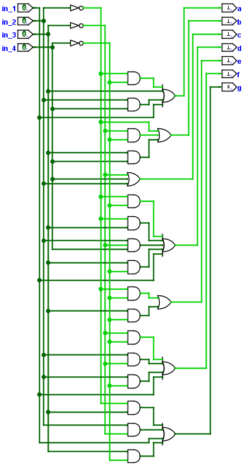

#### 1. Jasno zapišite **število in zaporedje mikroukazov**, ki se izvedejo pri izvedbi strojnega ukaza "**SW Rd,Immed**" (primer: "SWr3, 65535").

```
65:	addrsel=pc imload=1
	addrsel=immed datawrite=1 datasel=dreg, goto pcincr
```
`addrsel=pc` - izberemo programski števec za naslovno vodilo
`imload=1` - v takojšnji register shranimo takojšnji operand (65535)
`addrsel=immed` - izberemo register naslovnega vodila (immed)
`datawrite=1` - aktiviramo vpis v pomnilnik
`datasel=dreg` - izberemo vrednost, ki se bo vpisala na izbran naslov (naslov: immed - 65535 - 0xffff. vrednost: dreg - r3)
`goto pcincr` -  ker smo uporabili immed, dodatno povečamo programski števec, namesto za 1, se bo za 2
#### 2. Iz seznama strojnih ukazov, ki jih podpira zbirnik **izberite vsaj štiri** in zanje podajte ustrezna zaporedja mikroukazov za njihovo realizacijo. **Izbrani ukazi** naj bodo **bolj zahtevni oz. netrivijalni (op.koda večja od 15)** in iz različnih skupin - sestavljeni naj bodo iz vsaj 4 ali še bolje več mikroukazov (vaša uspešnost se bo merila tudi po tem kriteriju). Kratko opišite realizacijo in razložite predvsem mikroprogramske zapise dodanih strojnih ukazov v mikro-zbirniku.


##### ALU operacije z immed
 - addi Rd,Rs,immed - Rd <- Rs + immed, seštevanje konstante
	 - `aluop=add` - izberemo aritmetično logično enoto za seštevanje
	 - `op2sel=immed` - za drugi operand pri alu izberemo immed register
	 - `dwrite=1` - aktiviramo vpis v Rd register
	 - `regsrc=aluout` - izberemo vrednost, ki se bo vpisala v Rd (izhod iz alu)
    ```
    16: addrsel=pc imload=1
        aluop=add op2sel=immed dwrite=1 regsrc=aluout, goto pcincr
    ```
 - subi Rd,Rs,immed - Rd <- Rs - immed, odštevanje konstante
    ```
    17: addrsel=pc imload=1
        aluop=sub op2sel=immed dwrite=1 regsrc=aluout, goto pcincr
    ```
 - muli Rd,Rs,immed - Rd <- Rs * immed, množenje z konstanto
    ```
    18: addrsel=pc imload=1
        aluop=mul op2sel=immed dwrite=1 regsrc=aluout, goto pcincr
    ```
 - divi Rd,Rs,immed - Rd <- Rs / immed, deljenje z konstanto
    ```
    19: addrsel=pc imload=1
        aluop=div op2sel=immed dwrite=1 regsrc=aluout, goto pcincr
    ```
 - remi Rd,Rs,immed - Rd <- Rs % immed, ostanek pri deljenju z konstanto
    ```
    20: addrsel=pc imload=1
        aluop=rem op2sel=immed dwrite=1 regsrc=aluout, goto pcincr
    ```
 - andi Rd,Rs,immed - Rd <- Rs AND immed, bitna operacija `in` z konstanto
    ```
    21: addrsel=pc imload=1
        aluop=and op2sel=immed dwrite=1 regsrc=aluout, goto pcincr
    ```
 - ori Rd,Rs,immed - Rd <- Rs OR immed, bitna operacija `ali` z konstanto
    ```
    22: addrsel=pc imload=1
        aluop=or op2sel=immed dwrite=1 regsrc=aluout, goto pcincr
    ```
 - xori Rd,Rs,immed - Rd <- Rs XOR immed, bitna operacija `izključni ali` z konstanto
    ```
    23: addrsel=pc imload=1
        aluop=xor op2sel=immed dwrite=1 regsrc=aluout, goto pcincr
    ```
 - nandi Rd,Rs,immed - Rd <- Rs NAND immed,  bitna operacija `ne in` z konstanto
    ```
    24: addrsel=pc imload=1
        aluop=nand op2sel=immed dwrite=1 regsrc=aluout, goto pcincr
    ```
 - nori Rd,Rs,immed - Rd <- Rs NOR immed, bitna operacija `ne ali` z konstanto
    ```
    25: addrsel=pc imload=1
        aluop=nor op2sel=immed dwrite=1 regsrc=aluout, goto pcincr
    ```
 - lsli Rd,Rs,immed - Rd <- Rs << immed, logično premakne bite v levo za konstanto
    ```
    26: addrsel=pc imload=1
        aluop=lsl op2sel=immed dwrite=1 regsrc=aluout, goto pcincr
    ```
 - lsri Rd,Rs,immed - Rd <- Rs >> immed, logično premakne bite v desno za konstanto
    ```
    27: addrsel=pc imload=1
        aluop=lsr op2sel=immed dwrite=1 regsrc=aluout, goto pcincr
    ```
 - asri Rd,Rs,immed - Rd <- Rs >> immed (filled bits are the sign bit), enako kot lsli, le da uporabi vrednost predznaka za premaknjene bite
    ```
    28: addrsel=pc imload=1
        aluop=asr op2sel=immed dwrite=1 regsrc=aluout, goto pcincr
    ```
 - roli Rd,Rs,immed - Rd <- Rs <> immed, zavrti bite v levo za konstanto
    ```
    29: addrsel=pc imload=1
        aluop=rol op2sel=immed dwrite=1 regsrc=aluout, goto pcincr
    ```
 - rori Rd,Rs,immed - Rd <- Rs >< immed, zavrti bite v desno za konstanto
    ```
    30: addrsel=pc imload=1
        aluop=ror op2sel=immed dwrite=1 regsrc=aluout, goto pcincr
    ```
##### ALU operacije z carry
 - addc Rd,Rs,Rt,immed - podobno kot addi, le da še pogleda če se je zastavica c aktivirala in naredi skok, če ne pa poveča PC za 2
    ```
    31: addrsel=pc imload=1
        aluop=add op2sel=treg dwrite=1 regsrc=aluout, if c then jump else pcincr
    ```
- subc Rd,Rs,Rt,immed - podobno kot addc, le da je operacija odštevanja (sub)
    ```
    32: addrsel=pc imload=1
        aluop=sub op2sel=treg dwrite=1 regsrc=aluout, if c then jump else pcincr
    ```
##### Jump
 - jeq Rs,Rt,immed - če je Rs == Rt, naredi skok če se zastavica z aktivira pri odštevanju, če ne pa poveča PC za 2
    ```
    33: addrsel=pc imload=1
        aluop=sub op2sel=treg, if z then jump else pcincr
    ```     
- jne Rs,Rt,immed - če je Rs != Rt, obratno kot jeq
    ```
    34: addrsel=pc imload=1
        aluop=sub op2sel=treg, if z then pcincr else jump
    ```
- jgt Rs,Rt,immed - če je Rs > Rt, naredi skok če se zastavici n ali z nista aktivirali pri odštevanju, če ne, poveča PC za 2
    ```
    35: addrsel=pc imload=1
        aluop=sub op2sel=treg, if norz then pcincr else jump
    ```
- jle Rs,Rt,immed - če je Rs <= Rt. obratno kot jgt
    ```
    36: addrsel=pc imload=1
        aluop=sub op2sel=treg, if norz then jump else pcincr
    ```
- jlt Rs,Rt,immed - če je Rs < Rt - naredi skok če se je zastavica n aktivirala pri odštevanju, če ne, poveča PC za 2
    ```
    37: addrsel=pc imload=1
        aluop=sub op2sel=treg, if n then jump else pcincr
    ```
- jge Rs,Rt,immed  - če je Rs >= Rt, obratno kot jlt
    ```
    38: addrsel=pc imload=1
        aluop=sub op2sel=treg, if n then pcincr else jump
    ```
- jeqz Rs,immed - če je Rs == 0, enako kot jeq, le da se za op2sel uporablja const0 (Rs)
    ```
    39: addrsel=pc imload=1
        aluop=sub op2sel=const0, if z then jump else pcincr
    ```
 - jnez Rs,immed  - če je Rs != 0, obratno kot jeqz
    ```
    40: addrsel=pc imload=1
        aluop=sub op2sel=const0, if z then pcincr else jump
    ```
- jgtz Rs,immed - če je Rs > 0,  enako kot jgt, le da se za op2sel uporablja const0 (Rs)
    ```
    41: addrsel=pc imload=1
        aluop=sub op2sel=const0, if norz then pcincr else jump
    ```
- jlez Rs,immed - če je Rs <= 0, obratno kot jgtz
    ```
    42: addrsel=pc imload=1
        aluop=sub op2sel=const0, if norz then jump else pcincr
    ```
- jltz Rs,immed - če je Rs < 0, enako kot jlt, le da se za op2sel uporablja const0 (Rs)
    ```
    43: addrsel=pc imload=1
        aluop=sub op2sel=const0, if n then jump else pcincr
    ```
- jgez Rs,immed - če je Rs >= 0, obratno kot jltz
    ```
    44: addrsel=pc imload=1
        aluop=sub op2sel=const0, if n then pcincr else jump
    ```
- jmp immed - skok na immed naslov
    ```
    45: addrsel=pc imload=1, goto jump
    ```
##### Branch
Enako kot pri jump, le da se namesto `jump` uporabi na novo definiran `branch`, ki pc-ju doda immed.
 - beq Rs,Rt,immed
    ```
    46: addrsel=pc imload=1
        aluop=sub op2sel=treg, if z then branch else pcincr
    ```
- bne Rs,Rt,immed
    ```
    47: addrsel=pc imload=1
        aluop=sub op2sel=treg, if z then pcincr else branch
    ```
- bgt Rs,Rt,immed
    ```
    48: addrsel=pc imload=1
        aluop=sub op2sel=treg, if norz then pcincr else branch
    ```
- ble Rs,Rt,immed
    ```
    49: addrsel=pc imload=1
        aluop=sub op2sel=treg, if norz then branch else pcincr
    ```
- blt Rs,Rt,immed
    ```
    50: addrsel=pc imload=1
        aluop=sub op2sel=treg, if n then branch else pcincr
    ```
- bge Rs,Rt,immed
    ```
    51: addrsel=pc imload=1
        aluop=sub op2sel=treg, if n then pcincr else branch
    ```
- beqz Rs,immed
    ```
    52: addrsel=pc imload=1
        aluop=sub op2sel=const0, if z then branch else pcincr
    ```
- bnez Rs,immed
    ```
    53: addrsel=pc imload=1
        aluop=sub op2sel=const0, if z then pcincr else branch
    ```
- bgtz Rs,immed
    ```
    54: addrsel=pc imload=1
        aluop=sub op2sel=const0, if norz then pcincr else branch
    ```
- blez Rs,immed
    ```
    55: addrsel=pc imload=1
        aluop=sub op2sel=const0, if norz then branch else pcincr
    ```
- bltz Rs,immed
    ```
    56: addrsel=pc imload=1
        aluop=sub op2sel=const0, if n then branch else pcincr
    ```
- bgez Rs,immed
    ```
    57: addrsel=pc imload=1
        aluop=sub op2sel=const0, if n then pcincr else branch
    ```
- br immed
    ```
    58: addrsel=pc imload=1, goto branch
    ```
- branch - PC <- PC + immed
    ```
    branch: pcload=1 pcsel=pcimmed, goto fetch
    ```
##### Memory
- lw Rd, immed - nalaganje v register iz pomnilnika iz naslova immed
	```
	64: addrsel=pc imload=1 
	    addrsel=immed dwrite=1 regsrc=databus, goto pcincr
	```
#### 3. Nove strojne ukaze iz 2. naloge **uporabite v lastnem testnem programu** (enem ali večih) v zbirniku in preizkusite njihovo delovanje. Napišite tak(e) program(e), da se bodo dodani ukazi temeljito preizkusili. Razložite vsebino ustreznih strojnih ukazov. Opišite dogajanje ob vsakem strojnem ukazu in določite, **koliko urinih period traja** vsak od njih in vsi skupaj (zapišite trajanja za vsak ukaz v številu urinih period v posebni tabeli).


```
main:  li r0, 1             # 2 + 2 - v r0 se naloži 0x1
       li r1, 4             # 2 + 2 - v r1 se naloži 0x4
       lsli r0, r0, 2       # 3 + 2 - pri r0 se biti premaknejo v levo za 2, 0x4
       jeq r0, r1, equal    # 3 + 2 - jump eqaul
       addi r0, r0, 1       # 3 + 2 - se ne izvede
equal: subc r2, r0, r1, end # 3 + 2 - r0 se odsteje r1, v r2 se naloži 0x0
       subi r1, r1, 1       # 3 + 2 - r1 se odsteje 1, 0x3
       bne r0, r1, noteq    # 3 + 2 - branch noteq
       andi r2, r2, 1       # 3 + 2 - se ne izvede
noteq: lsri r1, r1, 2       # 3 + 2 - pri r1 se biti premaknjejo v desno za 2, 0x0
       jltz r1, equal       # 3 + 2 - r1 == 0, n zastavica je 0, brez jump-a
       bnez r2, main        # 3 + 2 - r2 == 0, z zastavica je 1, brez branch-a
end:   jmp end              # 2 + 2 - neskončna zanka
#                             Skupaj urinih period: 30 + 22 = 52
```

Pri vsakem ukazu sta še 2 urini periodi za `fetch`, zato je pri vsakem ukazu + 2
#### 4. **Pravilno umestite v pomnilniški prostor izhodni napravi FB 16x16 in TTY**po načelu "pomnilniško preslikanega vhoda/izhoda"- lahko uporabite nepopolno naslovno dekodiranje. Poskrbite, da se bo testni program za IO napravi po tej spremembi pravilno izvajal - torej se bosta izhodni**napravi pojavili za pisanje res samo na njima dodeljenih naslovih**. Spremenite testni program, da bo izrisoval vzorec na FB napravi po vaši zamisli.

Realizacija nepopolnega naslovnega dekodiranja, `mux` se potrebuje za pri dodatni vhodni napravi.



```
main:  li r1, 64     # r1 is current value (start ASCII char 64 @,A,B,C,D,...)
    li r5, 999     # counter value
    sw r5, 49153    # start countdown with start value of 999
    li r0, 2016    # FB value 2, 13
    sw r0, 16397    # FB line 13
    sw r0, 16386    # FB line 2
    li r0, 4080    # FB value 3, 12
    sw r0, 16396    # FB line 12
    sw r0, 16387    # FB line 3
    li r0, 8184    # FB value 4,11
    sw r0, 16395    # FB line 11
    sw r0, 16388    # FB line 4
    li r0, 16380    # FB value 5-10
    sw r0, 16394    # FB line 10
    sw r0, 16389    # FB line 5
    sw r0, 16393    # FB line 9
    sw r0, 16390    # FB line 6
    sw r0, 16392    # FB line 8
    sw r0, 16391    # FB line 7
loop:  sw r1, 32768    # Save current value to TTY... 
    addi r1, r1, 1   # r1 ... increment value
    lw  r5, 49153   # load value of countdown
    jnez r5, loop     # loop if r5 != 0
end:  jmp end           # loop forever
```

Program najprej izriše žogo in potem izpisuje črke dokler je counter-countdown večji od 0.

#### 5. V MiMo modelu je pripravljen prostor za še eno vhodno izhodno napravo. Opišite vsa potrebna opravila za **pravilno vključitev dodatne vhodno izhodne naprave** v MiMo model in jo tudi realizirajte (vsaj v enostavnejši obliki) ter preizkusite z ustreznim programom v zbirniku. Podajte jasen opis vseh korakov z vsemi potrebnimi podrobnostmi.

Realiziral sem števec, ki lahko hkrati šteje (štoparica) in odšteva (časovnik). Nastavi se mu lahko začetna vrednost do 999, če je več avtomatsko nastavi na 999. Odštevanje se začne na naslovih, ki imajo lsb 1, seštevanje pa na naslovih ki imajo lsb 0. Vrednost lahko tudi preberemo.

Testni program je v točki 4.
```
...
    li r5, 999     # counter value
    sw r5, 49153    # start countdown with start value of 999
...
    lw r5, 49153    # load value of countdown
...
```

Končen izgled in povezava naprave

Sprememba MiMo modela, da lahko prebere vrednosti iz naprav.

Realizacija naprave

Countdown - pri vrednostih (data > 9) vpiše le lsb in msb

Countup - pri vrednostih (data > 9) vpiše le lsb in msb

Generirana vezja z "Window -> Combinational Analysis"
- double dabble
	
- reverse double dabble
	
- BCD seven segment display
	