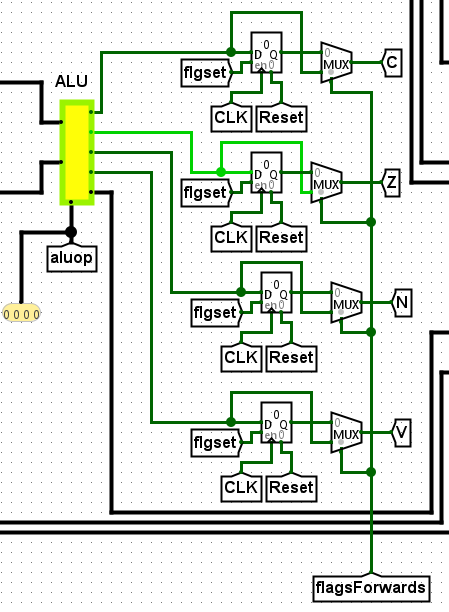
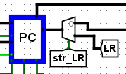

# Pipeline Hazard Optimizations

While our new pipelined model is more efficient than the previous version, it still runs into pipeline hazards that drop it's efficiency by a lot when they occur. The following 3 versions implement various ways to avoid these hazards either completely or as often as possible.

#### All of the previously described features with no pipeline hazard optimizations have been implemented in mimo\_32bit\_v2.circ.

## Pipeline Stall Version (mimo\_32bit\_v2.1)

The aim of this version is to show how an implementation with pipeline stalls works. The CPU detects when a Read-After-Write error is about to occur and stalls the pipeline accordingly to avoid it.&#x20;

I added a simple RAW-check circuit in the ID section.

<figure><figcaption>
RAW_Check sicruit
</figcaption></figure>

The circuit checks whether any of the 3 previous instructions:

* Wrote to the register bank (**dwrite**=1)

A RAW error occurs when an instruction reads from the Register Bank before a instruction preceding it writes to it.

We check the previous 3 instructions because it takes 3 cycles and pipeline stages for an instruction to go from the ID stage to the end of the WB stage.&#x20;

* Their condition was met

If the condition of the previous instruction is not met, it can not write to the Register Bank and a RAW therefore can not occur.

* The **dsel** is equal to the current **ssel** or is equal to the current **tsel** while **imload**=0

The destination register of the previous instruction must be equal to one of he registers being used in the current instruction( tsel is only active when not using an immediate value).

The circuit produces the **stall** and **bubble** signals when a incoming RAW is detected.

The **stall** signal stops the **pcload** and **irload** signals, so that no new instruction is loaded into the IF or ID stage.

The **bubble** signal replaces all signals inside the **ID -> EX** intermediate circuit with zeros(bubbles), so that the previous instructions that were causing the RAW may travel through the pipeline until they are no longer a problem.

<figure><figcaption>
Bubble connection to avoid infinite loop
</figcaption></figure>

The **bubble** signal is also connected to the shift registers that keep previous values of **Rd** and **cond\_met**. This is to ensure that when we encounter multiple RAWs one after another, an infinite loop doesn’t arise and a zero(bubble) is shifted into the shift register instead of the same value of the instruction.

An example can be seen and tested in the **Assembler/tests/test10.txt** file.

## Operand Forwarding Version (mimo\_32bit\_v2.2)

The aim of this version is to show how an implementation with operand forwarding works. The CPU detects when a Read-After-Write error is about to occur and forwards operands to the **ID->EX** transitional circuit, thus we always avoid it.

I based it on the previous version **v2.1 – Zaklenitev**, but I changed multiple things.

<figure><figcaption>
Changes to RAW_Check curcuit
</figcaption></figure>

The RAW checking circuit was changed to produce 2 signals. One to decide from what pipeline stage to forward **Rs** and one to decided from what pipeline stage to forward **Rt**.

It works on the following principle: If a RAW is detected in the first previous instruction, forward the operand from before the **EX -> MA** stage.

If no RAW is detected in the 1st previous instruction and a RAW is detected in the 2nd previous instruction, forward the operand from before the **MA -> WB** stage.

If no RAW is the detected in the 1st and 2nd previous instructions and a RAW is detected in the 3rd previous instruction, forward the operand from after the    **MA -> WB** stage.

If no RAW is detected at all, no operand forwarding is done.

<figure><figcaption>
Stall needed for ldr instruction
</figcaption></figure>

**No stall cycles are needed for ALU operations** with this method, the only time when a stall is needed is when the 1st previous instruction is a **ldr** instruction and a RAW is detected. Because operand memory access occurs in the 4th stage (MA), we do not know the value to be loaded inside the register to use in the EX stage, so we must stall one cycle to know the value.

<figure><figcaption>
Wiring to determine register source for forwarding
</figcaption></figure>

We determine what value (**operand, immed, sreg, aluout**) to forward to the next EX stage by looking at that instruction's **regsrc** signal.

If a RAW was detected in the 1st previous instruction, we take that instruction’s **regsrc** signal (**prevRegsrc**) to determine what value to forward. If it was detected in the 2nd previous instruction, **prevRegsrc1** is used, and if it was detected in the 3rd previous instruction, that means the operands are exiting the **MA->WB** transition block but haven't been written to the Register Bank yet, so we take the natural **regsrc** signal.&#x20;

<figure><figcaption>
Forwarding circuitry inside the ID->EX transition block
</figcaption></figure>

Inside the **ID -> EX** stage, the value to be loaded into the next EX stage is determined by the **sselforward** and **tselforward** signals produced by the **RAW\_Check** circuit.

<figure><figcaption>
Flag forwarding
</figcaption></figure>

We also forward the flags whenever a flag setting signal is activated the previous instruction, as if we do not do this, we would need to stall one cycle for the proper flags to be loaded into their registers.

An example can be seen and tested in the **Assembler/tests/test11.txt** file.

## Predictions Version (mimo\_32bit\_V2.3.2)

The aim of this version is to present an implementation using prediction methods to mitigate delays because of branches.&#x20;

The model is based on **v2.2 - Premoscanje** and builds upon it.

To implement predictions in our CPU model it only made sense to make the predictions in the IF stage, since naturally we already now the result of the prediction in the ID stage (since we are using **conditions based on** **flags already set**), so we only lose 1 cycle for every jump naturally. With predictions we want to minimize that to 0 cycles lost as often as possible.

Firstly we underline the mechanisms and changes needed for predicting and missing predictions.

<figure><figcaption>
circuitry checking if is branch/jump
</figcaption></figure>

In the IF stage after accessing the RAM, we check whether the instruction is a jump/branch which decides whether we should initialize predictions for that instruction.

We also run it through a register once to know next cycle if the previous instruction was predicted or not.

<figure><figcaption>
circuitry checking if unconditional branch
</figcaption></figure>

We also check if it a unconditional branch/jump, since if it is, the branch will always be taken.

<figure><figcaption>
prediction
</figcaption></figure>

After this we run the instruction through our desired prediction method (described later) and get our prediction. We also run it through a register to know what our prediction was next cycle.

Then, if we predicted a jump, we need to change the **pcsel** for the next fetch.

<figure><figcaption>
Changes to pcsel needed for prediction
</figcaption></figure>

If we conclude that we should predict (**should\_predict**) and if **we did not predict a jump**, the **pcsel** is set to 0 (PC = PC+1), **if we predicted a jump**, the **pcsel** is set to **pcsel1** which is derived from the instruction being processed, explained bellow.

<figure><figcaption>
circuitry checking if branch command and saving pcsel of branch or jump for prediction
</figcaption></figure>

Since if it is a branch or if it is a jump, the value of **pcsel** changes, and we don’t know the value of **pcsel** yet since that is derived normally in the ID stage. So we have to derive it as well in the IF stage.

**If we should predict and it is predicted to jump**, we store the value of the **predicted\_immed** inside the **immed** field of the PC. We also derive the **predicted\_immed** from the instruction when we decide if we should predict or not.

**If we should not predict this cycle**, the natural **immed** is stored inside the **immed** field of the PC, and the **pcsel** is either the natural **pcsel** derived from the control ROM or it is PC+1, based on whether the previous cycle we predicted an outcome. Since if we previously predicted an outcome, the natural **pcsel** will be that of the jump instruction, instead of the instruction proceeding it.

After we make our prediction the **next cycle we must check if it was correct**.

<figure><figcaption>
circuitry checking if prediction was correct
</figcaption></figure>

We check to see if the condition was met for that instruction and whether we previously predicted a jump or not. **If they are the same our prediction was correct**.

<figure><figcaption>
circuitry checking for incorrect prediction
</figcaption></figure>

But if we previously made a prediction and it was wrong, we need to **flush the pipeline**.

<figure><figcaption>
Flushing instruction coming into IF->ID
</figcaption></figure>

This means we need to remove the instruction coming into the ID stage currently.

<figure><figcaption>
Edited PC logic for predictions
</figcaption></figure>

We need to set the PC back to what it was previously when we made the prediction. This is why we change the PC logic for this version.

When we detect that we should predict an outcome, the **prev\_pc** register is loaded. When a pipeline flush is needed, the **flush** signal directs the **prev\_pc** signal instead of the **pcout.**

<figure><figcaption>
pcsel change for incorrect prediction
</figcaption></figure>

We need to set **pcsel** to the **opposite** of what we predicted previously.

#### Changes made for bl instruction (branch with link/subroutine call)

<figure><figcaption>
Changes to Link register for predictions
</figcaption></figure>

During the ID stage, if the **load\_LR** signal is read as true, **the next address after the address that contained the subroutine call** is loaded in the Link Register, i. e. **the previous PC value + 1.** This is taken instead of the current PC value because the Link Register must contain the return address after a subroutine call. In our prediction based model, if we made a pre-emptive jump in the IF stage, the PC value taken in the ID stage would be a completely wrong return address for the subroutine.

<figure><figcaption>
rts is read and processed right away
</figcaption></figure>

Regarding **rts** since it is always an unconditional jump, there is no need to make any prediction. so we read the **str\_LR** signal directly from the instruction in the IF stage through the circuitry pictured above.&#x20;

<figure><figcaption>
str_LR signal directing the PC to take the Link Register value
</figcaption></figure>

This **str\_LR** signal then directs the PC to take the value stored in the Link Register at the PC's immediate port. Since there are then no predictions to be made, the instruction flows normally and the PC is loaded with the return address next cycle.

Both the **instrUnload** and **str\_LR** control signals are not needed in this version of the CPU.

### Prediction Methods

<figure><figcaption>
Prediction method toggle
</figcaption></figure>

There are 4 prediction methods that we employ with varying rates of success. The method used can be toggled using the buttons pictured above.

<figure><figcaption>
Visual representation of prediction success rate
</figcaption></figure>

We also use 2 TTYs to visually represent branches taken(T) and not taken(N) and we can see how the predictions vary from the outcome.

<figure><figcaption>
Count of incorrect prediction
</figcaption></figure>

We also display a count of incorrect and total predictions to see a methods success rate..

<figure><figcaption>
<strong>prev_shld_predict</strong> signal indicating prediction result update
</figcaption></figure>

Addressing each prediction method requires the address of the jump/branch instruction. As previously mentioned, there are 2 stages to predictions when encountering a condition jump/branch instruction:

1. In the first stage, the instruction is in the IF stage and we need to make a prediction for the instruction, so when addressing the prediction methods, the current PC value is taken as the address of the instruction.
2. In the second stage, we need to check if our prediction was correct. The instruction is now in the ID stage, so the PC value has changed. All of our prediction methods need to be updated once we know the result of the jump, so we must address them again. So to address our prediction methods, we need to take previous PC value as the address. The **prev\_shld\_predict** signal indicated that we made a prediction the previous cycle, so we use it to toggle between the current PC and the previous one.

#### 1-bit Prediction Table

<figure><figcaption>
1-bit Prediction Table
</figcaption></figure>

The **1-bit prediction table** is the simplest prediction method. We have a 8 address memory that we address by the last 3 bits of our address, each memory location contains a 0 – Don’t jump or a 1 – Jump. After each prediction we update the memory based on whether we jumped or not.

This is the simplest method but it is also the least accurate. For every loop there are 2 mandatory missed predictions, one on loop enter, and one on loop exit.

An example using this method can be found in **Assembler/tests/test14-1\_bit.txt**

#### 2-bit Prediction Table

<figure><figcaption>
2-bit Prdiction Table
</figcaption></figure>

The **2-bit prediction table** works in a similar way, but each memory location is comprised of 2 bits, and there are 4 possible states:

* 00 – Strong Not Taken
* 01 – Weak Not Taken
* 10 – Weak Taken
* 11 – Strong Taken

The most significant bit signifies whether the branch should be taken or not. The transitions between states are listed in the image bellow:

<figure><figcaption>
Transition between states
</figcaption></figure>

This is more accurate than 1-bit predictions since there is only one mandatory missed prediction on loops, on loop reenters it correctly predicts the reenter.

An example using this method can be found in **Assembler/tests/test15-2\_bit.txt**

#### Correlating Predictor

<figure><figcaption>
Correlating Predictor
</figcaption></figure>

One problem with the previous prediction methods is that because we only address by the last 3 bits of our address (and we don’t have much address space for predictions), sometimes 2 jump instructions can have the same last 3 bits and therefore the same spot in the prediction table.

The correlating predictor fixes this by first running the address through a 8x3 Local History Table(LHT), that reroutes the address to a different prediction table location in our 2-bit predictor, which in this case we call the Local Prediction Table or LPT for short. After a prediction is made, the LHT address is updated by shifting a 1 or 0(Branch Taken or Not Taken) into the addressed LHT spot, based on what was the actual result of the branch. This then points to a different spot in the prediction table(LPT), that will be accessed on the next access of the LHT i.e., the next jump that has the same last 3 bits will not access the same prediction as the one before it.

To illustrate how this works better, we can view the example bellow:

&#x20;

<figure><figcaption>
Example code where a Correlating predictor thrives
</figcaption></figure>

In the code above, jump1 occurs every second loop, while jump2 never occurs. Let's say that the address of the jump1 instruction is 0010 and the address of the jump2 instruction is 1010. Both addresses share their last 3 bits, 010.

Using a 2-bit prediction table, where we address by the last 3 bits, these 2 instruction would have to share an address space in our prediction table, so their predictions would clash between one another.

<figure><figcaption>
Branch prediction of code above with 2-bit predictor
</figcaption></figure>

We end up getting an incorrect prediction for jump1 every second loop.

Using a correlating predictor, our 2 jump instructions would take up different spots in our Local Prediction Table. Using our example code above:

1. &#x20;The LHT address of 010 would first have a value of 000. This then points to address 000 of our LPT. The LPT address by default would have a value of 00(Strong Not Taken).&#x20;
2. Jump1 is predicted to not be taken, but in actuality is taken. Our prediction was incorrect.
3. The LHT address 010 is updated with the actual outcome of the branch, in this case since it is taken, a 1 is shifted into the value, so the value goes from 000 to 100. Now this LHT address points to address 100 of the LPT, which is 00(Strong Not Taken) by default. The value in LPT address 000 is updated to 01 (Weak Not Taken) for the future.
4. Jump2 is predicted to not be taken and it is not. Our prediction is correct.&#x20;
5. The LHT address 010 is again updated with the actual outcome of the branch, now since the branch was not taken, a 0 is shifted into the value, it goes from 100 to 010. Now our LHT address points to address 010 of the LPT.

<figure><figcaption>
Branch prediction of code above with correlating predictor
</figcaption></figure>

Eventually, after the 4th iteration in our example above, we predict correct jumps every time for each of our jump instructions.

The predictions are on average more correct using a correlating predictor when 2 jumps take up the same last 3 bits of the address.

This example can be found in **Assembler/tests/test16-correlating.txt**

#### Tournament Predictor

<figure><figcaption>
Tournament Predictor
</figcaption></figure>

One problem with the correlating predictor is that it is not always better than a standard 2-bit predictor. Sometimes the LHT rerouting can interfere with jumps that do not share the same last 3 bits.

The tournament predictor fixes this by **dynamically choosing whether to predict by local memory or global memory**.&#x20;

We have a Local History Table (LHT) and Local Prediction Table (LPT) that keep track the same as a correlating predictor, the Global History Register is updated after every prediction (1 is shifted into it if branch taken, 0 if not taken), the address from the GHR is used to address the Global Prediction Table (GPT), that acts as our standard 2-bit predictor, and the GHR is also used to address the Choice Prediction Table (CPT), which is updated the same way as a 2-bit prediction table. The result from the CPT is used to choose whether to take the prediction from the LPT or the GPT when they differ.

Let's look at an expanded form of the example used previously to better understand this.

<figure><figcaption>
Expanded code example
</figcaption></figure>

We add another jump instruction to our code, jump3, that functions the same as jump1 but importantly **does not share** the last 3 bits of it's address with jump1 and jump2.

Our code flows as follows:

1. AT the start, all of our prediction tables and registers (LHT, LPT, GPT, CPT, GHR) have values of 0. By default the first branch will be predicted as not taken, since the CPT will point to the value in the LPT and that will be 0.
2. When jump1 occurs, the branch is taken and our initial prediction is incorrect.&#x20;
3. The LHT and LPT are updated the same as with the correlating predictor above, the LHT address 010 is updated with the value 100, the LPT address 000 is updated to 01 (Weak Not Taken).&#x20;
4. The Global Prediction Table (GPT) address 000 is updated from 00 to 01 as well. This acts is a standard 2-bit predictor.
5. The Choice Prediction Table(CPT) address 000 is updated from 01 to 01 as well. This will again point to the LPT value next iteration.
6. The Global History Register (GHR) is updated with the actual outcome of the branch, so a 1 is shifted in this case, it goes from 000 to 100. This now points to a different address in our GPT and CPT.
7. Now jump2 occurs, The value in our GHR is 100 so it points to addresses 100 in our CPT and GPT. CPT address 100 contains the value of 00, so it again points to the value in our LPT.
8. The LHT is addressed by address 010 again, but it now points to address 100 in the LPT, which contains the value 00.
9. jump2 is predicted as not taken and is not. Our prediction was correct.
10. The LHT address 010 is updated with the value 010. The LPT address 100 value stays 00. The GPT address 100 is stays 00. The CPT address 100 also stays 00. The GHR is updated to 010.&#x20;

<figure><figcaption>
Branch predictions of code above
</figcaption></figure>

Because of the extra independent jump, our Local History Table is being modified and we are incorrectly predicting every second jump2 using the correlating predictor. After the 5th iteration of jump2, the tournament predictor is much more correct.

The tournament predictor has the highest rate of correct prediction out of every method used and is the most advanced method here.

This example can be found in **Assembler/tests/test17-tournament.txt**
